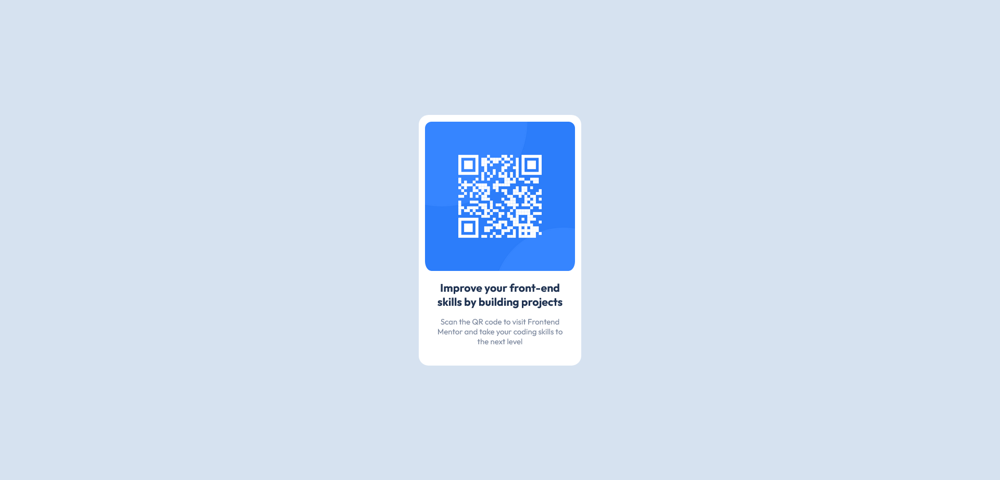

# Frontend Mentor - QR code component solution

This is a solution to the [QR code component challenge on Frontend Mentor](https://www.frontendmentor.io/challenges/qr-code-component-iux_sIO_H). Frontend Mentor challenges help you improve your coding skills by building realistic projects.

## Table of contents

- [Overview](#overview)
  - [Screenshot](#screenshot)
  - [Links](#links)
- [My process](#my-process)
  - [Built with](#built-with)
  - [What I learned](#what-i-learned)
  - [Continued development](#continued-development)
  - [Useful resources](#useful-resources)
- [Author](#author)
- [Acknowledgments](#acknowledgments)

**Note: Delete this note and update the table of contents based on what sections you keep.**

## Overview

### Screenshot

### Links

- Solution URL: [Link](https://github.com/julien-aw/Frontend-Mentor-QR-code-component)
- Live Site URL: [Link](https://julien-aw.github.io/Frontend-Mentor-QR-code-component/)

## My process

### Built with

- Semantic HTML5 markup
- CSS custom properties

### What I learned
  I learn more about card styling

### Continued development

 I'll focus on Responsive design

### Useful resources

- [HTML](https://developer.mozilla.org/fr/docs/Web/HTML)
- [CSS](https://developer.mozilla.org/fr/docs/Web/CSS)

## Author

- Frontend Mentor - [@julien-aw](https://www.frontendmentor.io/profile/julien-aw)
- Twitter - [@julienawon](https://www.twitter.com/julienawon)
- Linkedin - [@julien-aw](https://www.linkedin.com/in/julien-aw/)

## Acknowledgments
 julien AWON'GA
